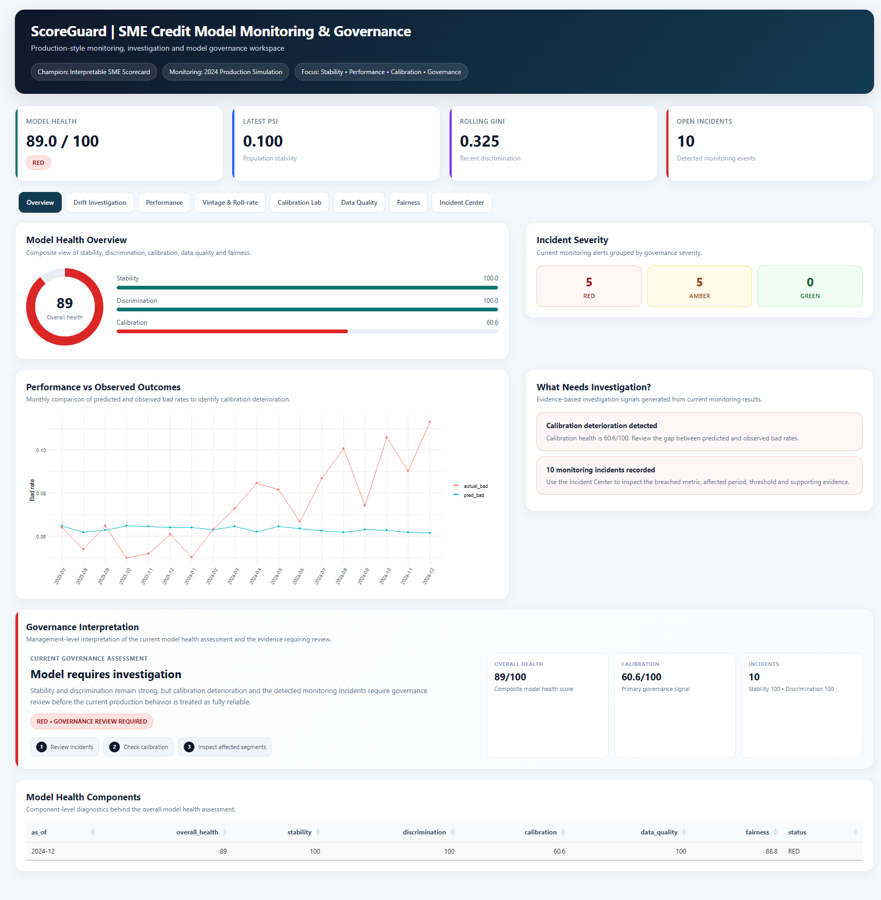
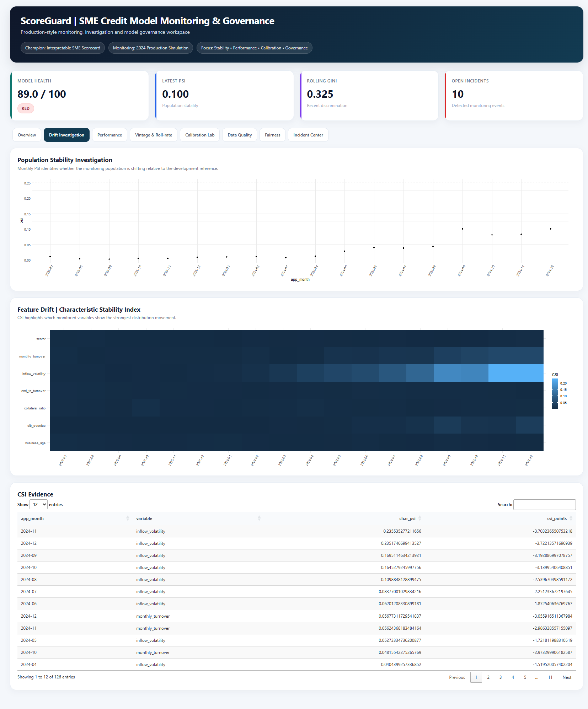
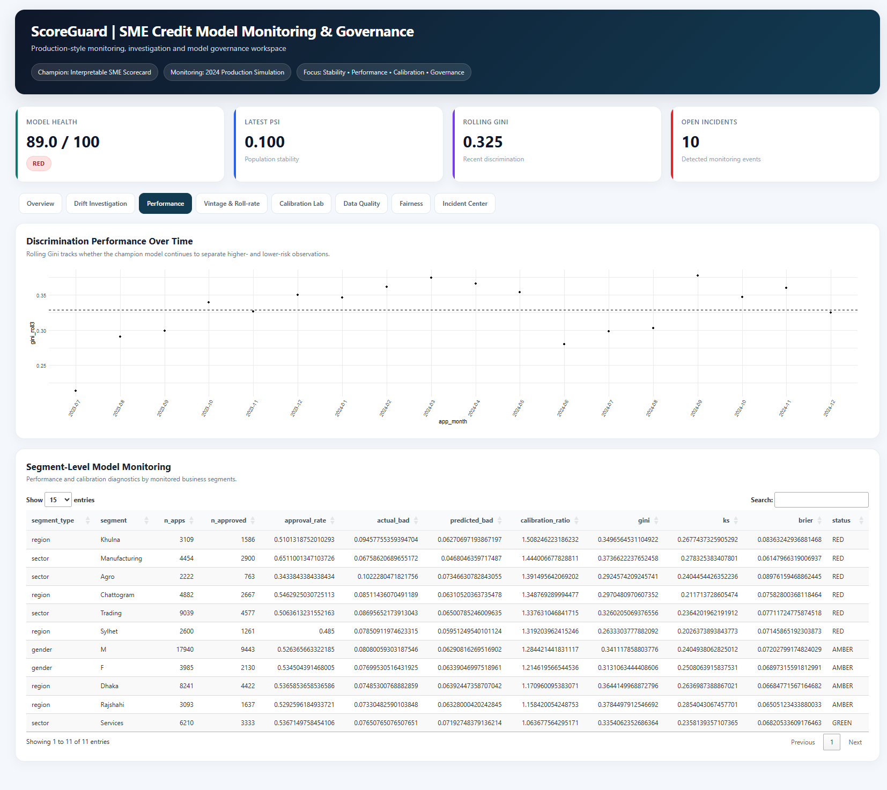
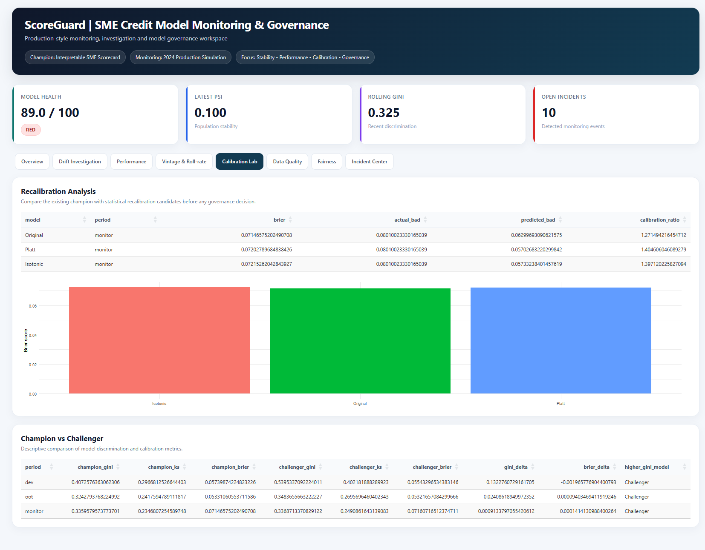
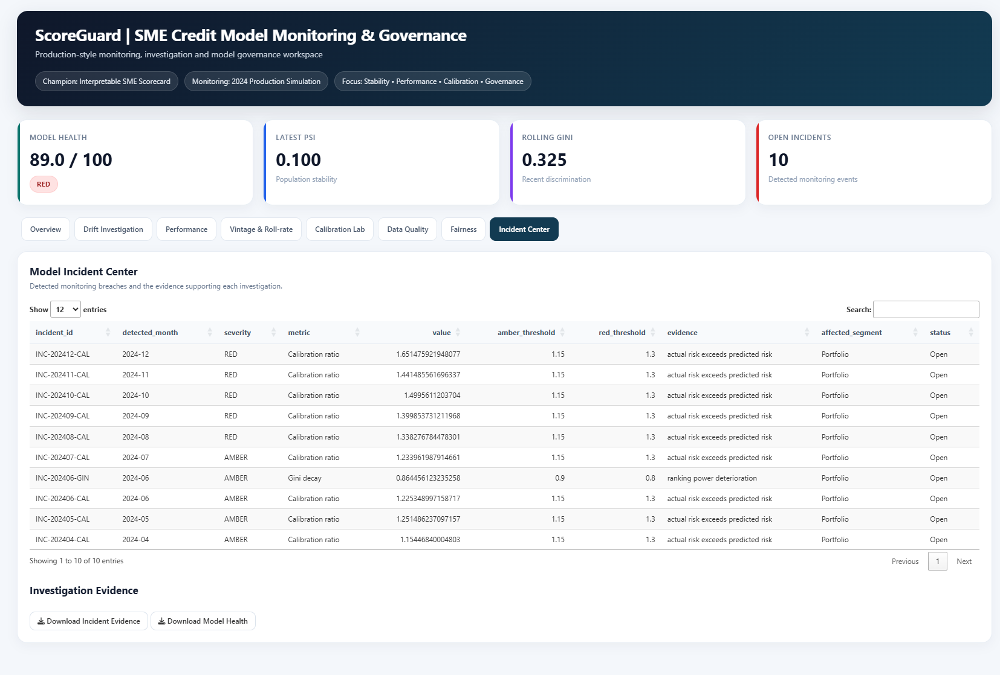

# 🛡️ ScoreGuard
### SME Credit Model Monitoring & Governance Platform

<p align="center">
  <strong>Production-style monitoring, investigation and model governance workspace for SME credit models.</strong>
</p>

<p align="center">
  
  
  
  
</p>

---

## 🎯 What is ScoreGuard?

**ScoreGuard** is an SME credit **model monitoring and governance platform** built around one production question:

> **“Is our existing credit model still trustworthy, stable, calibrated and performing well?”**

Instead of focusing primarily on developing a new credit score, ScoreGuard assumes that a **champion credit model already exists** and continuously evaluates its reliability using production-like predictions and observed outcomes.

### Core workflow

```text
Existing Champion Model
          ↓
Production Predictions + Outcomes
          ↓
Drift • Performance • Calibration
          ↓
Data Quality • Fairness • Segments
          ↓
Vintage • Roll-rate Analysis
          ↓
Model Health Score
          ↓
Incident Detection
          ↓
Recalibration / Challenger Analysis
          ↓
Governance Investigation
          ↓
Monthly Governance Report
```

---

# 📸 Dashboard Preview

## 📊 Executive Model Health Dashboard

The main workspace combines model health, stability, performance, calibration, incidents and governance signals.

<p align="center">
  
</p>

**Highlights**
- Model Health score
- Latest PSI
- Rolling Gini
- Open incidents
- Stability, discrimination and calibration indicators
- Incident severity
- Actual vs predicted bad-rate trend
- Investigation signals
- Governance interpretation

---

## 🔍 Drift Investigation

Identifies population-level and feature-level distribution changes.

<p align="center">
  
</p>

**Includes**
- Monthly PSI monitoring
- PSI thresholds
- Feature-level CSI heatmap
- CSI evidence table
- Searchable investigation data

**Question answered:**  
> What changed in the monitored population, and which variables are driving the shift?

---

## 📈 Model Performance Monitoring

Evaluates whether predictive performance remains consistent over time.

<p align="center">
  
</p>

**Monitored metrics**
- Gini
- KS
- Brier score
- Actual vs predicted bad rate
- Development, OOT and monitoring performance

---

## 🧪 Calibration Lab

Treats calibration as a dedicated model-governance dimension.

<p align="center">
  
</p>

**Evaluates**
- Original model calibration
- Platt scaling
- Isotonic regression
- Brier score
- Predicted bad rate
- Calibration ratio

Recalibration candidates are evaluated using evidence rather than automatically promoted.

---

## 🚨 Model Incident Center

Converts monitoring results into traceable governance events.

<p align="center">
  
</p>

Each incident can capture:
- Detection period
- Severity
- Breached metric
- Observed value
- Threshold
- Supporting evidence
- Affected segment
- Investigation status

```text
Metric Breach → Evidence → Investigation → Governance Action
```

---

# ✨ Key Capabilities

| Capability | Purpose |
|---|---|
| 📊 Model Health | Composite view of stability, discrimination, calibration, data quality and fairness |
| 🌊 PSI | Population stability monitoring |
| 🔬 CSI | Feature-level stability monitoring |
| 📈 Gini / KS / Brier | Model performance monitoring |
| 🎯 Calibration | Predicted vs observed behaviour and calibration ratio |
| 🕐 OOT Validation | Out-of-time performance assessment |
| 📅 Vintage | Cohort-level portfolio behaviour |
| 🔄 Roll-rate | Delinquency movement analysis |
| 🧩 Segments | Sector, region and gender monitoring |
| 🧹 Data Quality | Missingness, duplicates and invalid-value checks |
| ⚖️ Fairness | Segment-level fairness indicators |
| 🆚 Champion vs Challenger | Descriptive model comparison |
| 🧪 Recalibration Lab | Platt and isotonic regression evaluation |
| 🚨 Incident Center | Threshold breaches and supporting evidence |
| 📋 Governance Report | Automated monthly monitoring report |

---

# 🩺 Model Health Framework

```text
                 MODEL HEALTH
                      │
        ┌─────────────┼─────────────┐
        ↓             ↓             ↓
    Stability    Discrimination  Calibration
        │             │             │
        └─────────────┼─────────────┘
                      ↓
             Data Quality + Fairness
                      ↓
              Governance Status
```

The health score is a **monitoring summary**. The underlying metrics and incidents provide the evidence required for investigation.

---

# 🚨 Why Monitoring Matters

A model can look stable from one perspective while deteriorating from another.

For example:

- Population drift may remain modest.
- Discrimination may remain relatively stable.
- Predicted and observed bad rates may diverge.
- Calibration can therefore deteriorate even when PSI alone does not indicate a major shift.

ScoreGuard keeps these monitoring dimensions separate so that **drift is not treated as a substitute for performance validation**.

---

# 🏗️ Architecture

```text
┌──────────────────────────────────────────────┐
│          Existing Champion Model             │
└──────────────────────┬───────────────────────┘
                       ↓
┌──────────────────────────────────────────────┐
│      Production-like Predictions + Outcomes  │
└──────────────────────┬───────────────────────┘
                       ↓
┌──────────────────────────────────────────────┐
│             Monitoring Engine                │
│  PSI • CSI • Gini • KS • Brier • Calibration│
└──────────────────────┬───────────────────────┘
                       ↓
┌──────────────────────────────────────────────┐
│ Data Quality • Fairness • Segment Monitoring│
└──────────────────────┬───────────────────────┘
                       ↓
┌──────────────────────────────────────────────┐
│        Vintage • Roll-rate • Investigation   │
└──────────────────────┬───────────────────────┘
                       ↓
┌──────────────────────────────────────────────┐
│        Model Health + Incident Center        │
└──────────────────────┬───────────────────────┘
                       ↓
┌──────────────────────────────────────────────┐
│ Recalibration + Champion/Challenger Analysis │
└──────────────────────┬───────────────────────┘
                       ↓
┌──────────────────────────────────────────────┐
│       Governance Investigation & Report       │
└──────────────────────────────────────────────┘
```

---

# 🛠️ Technology Stack

| Layer | Technology |
|---|---|
| Dashboard | **R Shiny** |
| Monitoring Pipeline | **Python** |
| Database | **SQLite + SQL** |
| Statistics | **R / Python** |
| Machine Learning | **scikit-learn** |
| Visualization | **ggplot2** |
| Data Processing | **Pandas / dplyr** |
| Reporting | **HTML / Shiny** |

---

# 📁 Project Structure

```text
scoreguard/
├── data/
│   └── scoreguard.db
├── outputs/
│   ├── champion_challenger.csv
│   ├── data_quality.csv
│   ├── model_health.csv
│   ├── model_incidents.csv
│   ├── model_metrics.csv
│   ├── mon_csi.csv
│   ├── mon_fairness.csv
│   ├── mon_monthly.csv
│   ├── mon_roll.csv
│   ├── mon_vintage.csv
│   ├── recalibration_lab.csv
│   └── segment_monitoring.csv
├── python/
│   ├── 01_generate_data.py
│   ├── 02_scorecard.py
│   ├── 04_monitoring.py
│   └── lib.py
├── R/
│   ├── shiny/
│   │   └── app.R
│   └── README.md
├── reports/
│   └── monthly_model_governance_report.html
├── screenshots/
│   ├── calibration_lab.png
│   ├── dashboard.png
│   ├── drift_investigation.png
│   ├── incident_center.png
│   └── performance_monitoring.png
├── sql/
│   └── features.sql
├── .gitignore
├── LICENSE
├── README.md
├── requirements.txt
├── run_all.py
└── run_all.sh
```

---

# 🚀 Run Locally

### 1. Clone

```bash
git clone https://github.com/Saikot313/scoreguard.git
cd scoreguard
```

### 2. Create environment

**Windows**
```powershell
python -m venv .venv
.venv\Scriptsctivate
```

**Linux / macOS**
```bash
python3 -m venv .venv
source .venv/bin/activate
```

### 3. Install dependencies

```bash
pip install -r requirements.txt
```

### 4. Run the pipeline

```bash
python run_all.py
```

### 5. Launch Shiny

```r
shiny::runApp("R/shiny")
```

---

# 📊 Monitoring Outputs

```text
Model Health
├── model_health.csv
├── model_incidents.csv
└── model_metrics.csv

Drift
└── mon_csi.csv

Performance
└── mon_monthly.csv

Calibration
└── recalibration_lab.csv

Portfolio Behaviour
├── mon_vintage.csv
└── mon_roll.csv

Data Quality
└── data_quality.csv

Fairness
└── mon_fairness.csv

Segments
└── segment_monitoring.csv
```

---

# 🔐 Data & Reproducibility

> **Important:** ScoreGuard uses **synthetically generated SME credit data** for demonstration and portfolio purposes.

No real customer, borrower or confidential financial data is used.

The synthetic environment allows controlled monitoring scenarios such as population movement, feature drift, calibration deterioration and threshold breaches.

---

# 🔬 Validation Philosophy

ScoreGuard intentionally separates:

**Drift detection**  
from  
**Model performance validation**  
from  
**Governance investigation**

A drift signal does not automatically mean a model has failed, and low drift does not guarantee that a model remains well calibrated or predictive.

The platform therefore combines multiple sources of evidence before presenting a governance status.

---

# 🎓 Portfolio Positioning

ScoreGuard is intentionally focused on **model lifecycle, monitoring and governance**.

| Credit Analytics | ScoreGuard |
|---|---|
| Develop credit models | Monitor an existing model |
| Loan analytics | Production monitoring |
| Credit scoring | Model health |
| Risk prediction | Drift detection |
| Model development | Model lifecycle |
| Decision analytics | Governance |

> **Credit analytics asks:** “Which borrower is risky?”  
>
> **ScoreGuard asks:** “Is our existing model still reliable?”

---

# 👨‍💻 Author

**Md. Sakender Saikot**

MSc in Computer Science, Major in Data Science  
American International University-Bangladesh

BSc in Computer Science & Engineering  
Varendra University

**Interests:** Data Science · Credit Risk Analytics · Machine Learning · Model Monitoring · MLOps · Statistical Analysis · Data Visualization

---

<p align="center">
  <sub>Built as a portfolio project to demonstrate end-to-end credit model monitoring and governance capabilities.</sub>
</p>
